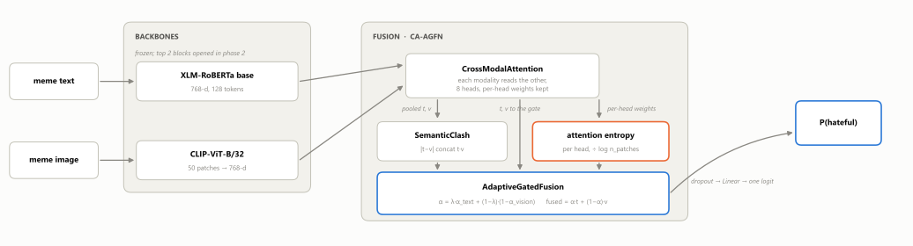
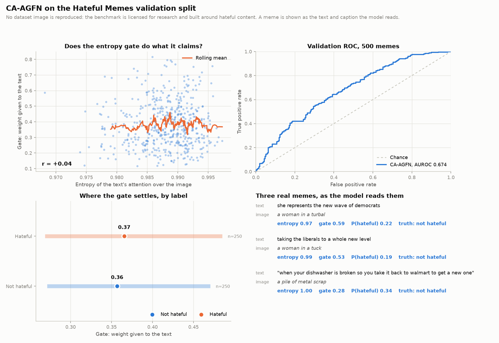
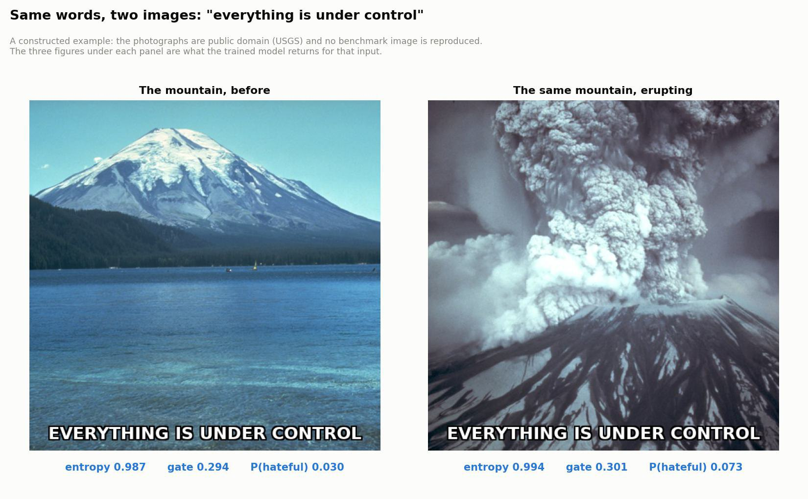

# CA-AGFN: Clash-Aware Adaptive Gated Fusion

[](https://github.com/no0e/hateful-memes-ca-agfn/actions/workflows/tests.yml)
[](https://www.python.org/downloads/)
[](LICENSE)

Detecting hateful memes, on the premise that a meme is rarely hateful in its
text alone or its image alone. It is hateful in the gap between them: a caption
that is innocuous under one picture and vicious under another.

Meta's Hateful Memes benchmark is built to force that point. For most hateful
memes in it there exists a benign one carrying the same text over a different
image, or the same image under different text. A model that reads one modality
and ignores the other cannot separate those pairs even in principle.

So this model builds the gap explicitly rather than hoping a classifier finds it
in a concatenation, and then decides how much to trust each side.

## The architecture

<p align="center">
  
</p>

The entropy path is the part that is mine, and the one the results section
reports as not working.

**Cross-modal attention.** Each modality reads the other, and the text-to-vision
attention distribution is kept, because the gate downstream is computed from it.

**Semantic clash.** The gap itself, as a vector: `|t - v|` concatenated with
`t * v`, projected down. The first term is how far apart the two pooled
representations are, the second is where they agree. A plain concatenation of
`t` and `v` contains the same information and makes none of it explicit.

**Language-conditioned entropy gate.** This is the part that is mine. The
entropy of the text's attention over the image says how sharply the text is
pointing at anything. Text that commits to a region is text worth weighting.
Text whose attention is spread evenly over every patch is text that is not
saying much, and the image should decide instead. The gate reads that entropy
alongside the clash, a second gate reads the image, and a learned scalar
interpolates between the two strategies rather than committing to one at design
time.

```
alpha_text   = sigmoid(W [t ; clash ; entropy])
alpha_vision = sigmoid(W [v ; clash])
alpha        = lambda * alpha_text + (1 - lambda) * (1 - alpha_vision)
fused        = alpha * t + (1 - alpha) * v
```

Entropy is normalised by `log(n_patches)`, so it lands in [0, 1] and keeps its
meaning across image encoders with different patch counts. It is also
renormalised before it is measured, because attention dropout in training mode
leaves weights that sum to about 0.9 rather than to 1, and an entropy taken over
that is being read off something that is not a distribution.

Backbones are XLM-RoBERTa and CLIP-ViT-B/32. Memes carry multilingual and
transliterated text, which is what XLM-R is for.

## The bug this repository exists to fix

An earlier version of this work trained phase one to an AUROC of 0.611 and then
died four lines into phase two, on ten consecutive non-finite losses. The
diagnosis is worth writing down, because the bug was in the safety net.

That loop checked whether the **loss** was finite and skipped the step if it was
not. At the first step of phase two the loss was finite. The backward pass
through the newly unfrozen backbone produced non-finite **gradients**.
`clip_grad_norm_` computed a total norm of NaN, divided every gradient by it,
and so turned all of them into NaN. The optimiser wrote those into the weights.
From the next step onward every forward pass returned NaN, the loss check fired
on all of them, and the run aborted ten steps later having lost the model at
step zero.

The fix is one check in the right place: gradients are tested for finiteness
after the backward pass and before the clip. `tests/test_model.py` demonstrates
the mechanism rather than asserting it, by clipping a set of gradients where
exactly one entry is NaN and showing that an untouched, finite gradient
elsewhere in the model comes back non-finite.

```python
if not gradients_are_finite(model):
    skipped += 1
    optimiser.zero_grad(set_to_none=True)
    continue
torch.nn.utils.clip_grad_norm_(model.parameters(), config.grad_clip)
optimiser.step()
```

`skipped_steps` is recorded every epoch and printed at the end, because a guard
that silently eats half the batches is its own kind of failure.

## Results

<p align="center">
  
</p>

| | |
|---|---|
| Phase 1, backbones frozen | AUROC 0.6424 |
| Phase 2, top two blocks open | **AUROC 0.6741** |
| Accuracy | 0.6080 |
| Macro F1 | 0.5936 |
| Steps dropped as non-finite | **0** |

Validation split, 500 memes. Twenty-five epochs before early stopping, about
forty minutes on one NVIDIA A2.

**Phase 2 completes.** The version this grew from died four lines into it, on
ten consecutive non-finite losses. Nothing diverged here, and the guard counted
zero dropped steps, so the divergence was the configuration rather than
something the guard had to catch: XLM-RoBERTa in place of DeBERTa-v3, and only
the top two blocks opened.

**0.674 is a modest number and worth putting in context.** On this benchmark,
published text-only baselines sit around 0.65 to 0.69, late fusion around 0.70,
ViLBERT around 0.71 to 0.73, and humans at 0.85. This model is at the level of
a unimodal baseline, not above it. Two blocks unfrozen, twenty-five epochs and
encoders with no joint pretraining is most of the explanation.

## The entropy gate does not work

The architecture claims that the entropy of the text's attention decides how
much the text is trusted. That claim is testable, so the first panel of the
figure tests it, over all 500 validation memes.

**The correlation is r = +0.036.** No relationship, and the wrong sign: the
design says diffuse text should shift weight *to* the image, which would be
negative.

The reason is visible in the worked example below. The entropy sits at 0.99 for
every input, which is the maximum. The cross-modal attention never learns to
concentrate on anything, and nothing in the loss asks it to. A quantity that
does not vary cannot drive a gate; entering a linear layer, it only shifts a
bias.

This was measured twice, on two formulations. The first took the entropy of the
head-averaged attention, which is flat by construction, since entropy is
concave and eight sharp heads pointing in different directions average to
something near-uniform. `tests/test_model.py` builds exactly that case and
measures 0.00 per head against 0.99 averaged. Fixing it to take the entropy per
head and average afterwards is the right computation and changed nothing:
r went from +0.047 to +0.036, AUROC from 0.6744 to 0.6741.

So the gate is implemented, and it carries no signal. Making it work is not a
matter of tuning: it needs a term in the loss that penalises uniform attention,
or supervision on the attention itself.

The rest of the model is unaffected. The clash feature and the fusion do
respond to the image, which the example below shows directly.

## A worked example

<p align="center">
  
</p>

The same line of text over two images. Against the calm mountain it is literal;
against the eruption it says the opposite. That is the structure the benchmark
is built on: for most hateful memes there exists a benign one with the same
text over a different picture, so neither modality alone separates the pair.

| | entropy | gate | P(hateful) |
|---|---|---|---|
| The mountain, before | 0.987 | 0.294 | 0.030 |
| The same mountain, erupting | 0.994 | 0.301 | **0.073** |

The text is identical byte for byte, so every difference comes from the image.
`P(hateful)` more than doubles while the gate moves by 0.007. The model reads
the image; it just does not read it through the gate.

Both photographs are public domain, from the United States Geological Survey,
with their provenance in `docs/example/PROVENANCE.md`. **No image from the
benchmark is reproduced here**: its licence forbids hosting or distributing the
dataset to third parties, with no exception for attribution, and it is built
around hateful content besides. The example is constructed; the numbers are
what the trained model returned.

```bash
python scripts/example.py --text "your caption here"
```

## Quick start

```bash
git clone https://github.com/no0e/hateful-memes-ca-agfn.git
cd hateful-memes-ca-agfn
pip install -r requirements.txt

pytest tests/ -q                  # 16 tests, no dataset and no GPU needed
python scripts/train.py --smoke   # 64 samples, one epoch per phase
```

The smoke run exercises the whole path on a CPU in a couple of minutes. It
proves the code runs. It proves nothing about the model.

For a real run you need the dataset:

```bash
python scripts/fetch_data.py      # needs a Kaggle token, see below
python scripts/captions.py        # optional, one pass of BLIP over the images
python scripts/train.py
```

## The dataset

Meta's Hateful Memes: 10,000 memes, each an image with its overlaid text already
extracted, labelled hateful or not, about 36% positive. It is not
redistributable, so `scripts/fetch_data.py` downloads it and this repository
ships none of it.

It needs a Kaggle API token at `~/.kaggle/kaggle.json`, or Meta's own release at
hatefulmemes.org under their research licence. The script tells you which step
is missing and never handles the token itself.

`scripts/captions.py` is optional. It runs BLIP once over every image and writes
a caption beside each row, so the text encoder reads
`<overlaid text> [SEP] <what the picture shows>` and the clash feature has two
descriptions of the same meme to compare. Training picks the captioned files up
automatically if they exist.

## Training

Two phases, for a reason.

Phase one trains only the new modules against frozen backbones. Starting with
everything unfrozen sends a large gradient from a randomly initialised head
straight into pretrained weights, which is how the useful part of a pretrained
encoder is destroyed in the first few steps.

Phase two opens the top two transformer blocks of each backbone, with layer-wise
learning rate decay so deeper blocks move less. Embeddings, position tables and
final layer norms stay frozen throughout.

Both phases validate on EMA weights, keep the best checkpoint by AUROC, and stop
early when it stops improving.

## Layout

```
ca_agfn/
  config.py      every hyperparameter, with the reason beside the chosen ones
  data.py        the dataset, tokenised once, with a missing-image count
  model.py       cross-modal attention, semantic clash, the entropy gate
  training.py    two-phase training, EMA, and the gradient guard
scripts/         fetch_data, captions, train
tests/           16 tests, CPU only, seconds to run
```

## Requirements

Python 3.10 or later, PyTorch 2.1 or later, transformers, scikit-learn, pandas,
Pillow. A GPU for training; the tests and the smoke run do not need one.

## License

MIT for the code. See [LICENSE](LICENSE). The dataset is Meta's and carries its
own terms.
