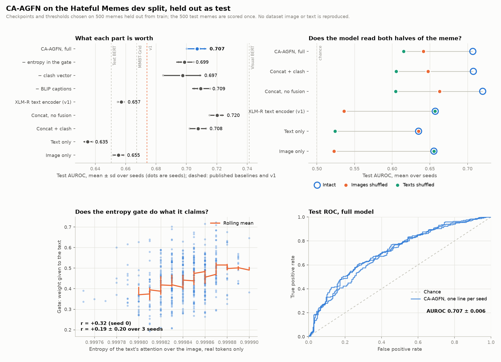
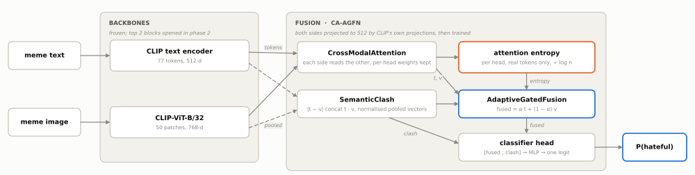
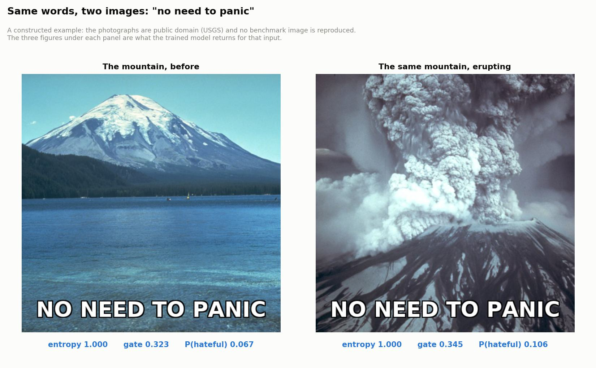

# CA-AGFN: Clash-Aware Adaptive Gated Fusion

[](https://github.com/no0e/hateful-memes-ca-agfn/actions/workflows/tests.yml)
[](https://www.python.org/downloads/)
[](LICENSE)

Hateful meme detection on Meta's Hateful Memes benchmark, built on one premise:
a meme is rarely hateful in its text alone or its image alone, but in the gap
between them. So the model computes that gap explicitly, a *clash* vector
between CLIP's text and image embeddings, and gates how much to trust each
side.

- **Test AUROC 0.707 ± 0.006 over three seeds** on the benchmark's 500-meme
  dev split, held out entirely: checkpoints and thresholds are chosen on 500
  memes taken from train. The first version reported 0.674 on a split it was
  also tuned on. On these same 500 memes the benchmark paper reports 0.651 for
  text-only BERT, 0.667 for MMBT-Grid and 0.741 for Visual BERT.
- **The premise does not survive its ablations.** Concatenating CLIP's two
  pooled vectors under an MLP does at least as well, 0.720 ± 0.004, and adding
  the clash vector to that concatenation *lowers* it to 0.708 ± 0.005. At this
  scale an explicit gap tells the classifier nothing it cannot find itself.
- **What does matter is a shared space.** CLIP on both sides is worth 0.05
  AUROC over the first version's XLM-R text encoder. With XLM-R, shuffling the
  texts between memes changed nothing (0.657 either way): that model had
  silently become an image-only model.
- **The model reads both halves of the meme.** Pair each text with another
  meme's image and the AUROC falls from 0.707 to 0.641; pair each image with
  another text and it falls to 0.615.
- **The entropy gate, the part I designed, does not work, and the repository
  shows why.** The text's attention over the image never leaves its
  initialisation: its logits differ across the 50 image positions by 0.034
  after training and 0.033 before it, so the softmax is uniform and the gate
  reads a constant.
- **This is version 2.** The first version chose its checkpoints on its test
  split, measured its entropy mostly on padding tokens, and never let its
  classifier see the clash. [What changed, and why](#what-version-2-fixes).

<p align="center">
  
</p>

## Results

| Model | Test AUROC | Accuracy | Macro F1 | AUROC, images shuffled | AUROC, texts shuffled |
|---|---|---|---|---|---|
| **CA-AGFN, full** | **0.707 ± 0.006** | 0.598 ± 0.011 | 0.557 ± 0.015 | 0.641 ± 0.008 | 0.615 ± 0.026 |
| without the entropy input to the gate | 0.699 ± 0.005 | 0.613 ± 0.023 | 0.579 ± 0.042 | 0.639 ± 0.008 | 0.600 ± 0.026 |
| without the clash vector | 0.697 ± 0.012 | 0.566 ± 0.009 | 0.501 ± 0.026 | 0.614 ± 0.007 | 0.610 ± 0.027 |
| without BLIP captions | 0.709 ± 0.006 | 0.591 ± 0.021 | 0.546 ± 0.031 | 0.627 ± 0.006 | 0.600 ± 0.027 |
| XLM-R text encoder (the v1 backbone) | 0.657 ± 0.002 | 0.561 ± 0.007 | 0.498 ± 0.015 | 0.536 ± 0.010 | 0.657 ± 0.002 |
| Concatenated CLIP vectors, no fusion | **0.720 ± 0.004** | 0.589 ± 0.006 | 0.538 ± 0.012 | 0.663 ± 0.017 | 0.605 ± 0.026 |
| Concatenated CLIP vectors and the clash | 0.708 ± 0.005 | 0.595 ± 0.015 | 0.554 ± 0.034 | 0.648 ± 0.016 | 0.605 ± 0.029 |
| Text only | 0.635 ± 0.003 | 0.542 ± 0.002 | 0.487 ± 0.009 | 0.635 ± 0.003 | 0.524 ± 0.015 |
| Image only | 0.655 ± 0.004 | 0.570 ± 0.002 | 0.524 ± 0.009 | 0.523 ± 0.014 | 0.655 ± 0.004 |

Mean ± standard deviation over three seeds; every row is the full model with
one thing changed. The per-run files are in [`results/`](results) and the table
in [`results/summary.md`](results/summary.md). Accuracy and F1 use a threshold
chosen on the validation hold-out.

Test split: the 500 memes of the official dev split, balanced 50/50 and built
by the benchmark's authors to be hard: 40% multimodal hate and 40% benign
*confounders*, memes that share their text or their image with a hateful one.
Model selection reads 500 memes held out from train, which is 36% hateful and
not balanced to that mix. That is why validation AUROC sits around 0.77 while
test AUROC sits around 0.71. The test number is the one reported, and nothing
was chosen on it.

Two kinds of uncertainty, and they are not the same size. Each run carries a
bootstrap 95% interval on its test AUROC of about ±0.045: that is what having
only 500 test memes costs, and a difference smaller than it could reverse on
another 500. The seeds measure something else, the variation from training,
about ±0.006 here. A variant that beats another on every seed beats it on these
500 memes; whether it would on others is not settled here.

**Published baselines on the same 500 memes** (Kiela et al., 2020, Table 1,
validation AUROC): Text BERT 0.651, Late Fusion 0.651, Concat BERT 0.659,
MMBT-Grid 0.667, ViLBERT 0.722, Visual BERT 0.741. Humans reach 84.7% accuracy
on the test set. Later work built on CLIP goes much further: Hate-CLIPper
reports 0.858 on the challenge's test data, above the 0.827 human AUROC. This
model uses ViT-B/32 with two blocks unfrozen and trains in about ten minutes
on a T4; the comparison it can support is between its own ablations.

## What the ablations say

**The shuffle test works as a check on itself.** A text-only model is blind to
images being shuffled (0.635 either way) and an image-only model to texts being
shuffled (0.655 either way), which is what a correct shuffle must produce.
Every fused model built on CLIP loses under both shuffles, so all of them read
both halves.

**The shared space is the change that matters.** Replacing CLIP's text encoder
with XLM-RoBERTa, the first version's choice, costs 0.05. It does worse than
that number says: shuffling its texts leaves it at 0.657, the score of the
image-only model. Frozen XLM-R's mean-pooled sentences, projected into a space
nothing aligned them with, gave the classifier nothing it used, and training
settled on the image alone. Nothing in the first version would have shown
this.

**The fusion does not beat concatenation.** The two pooled CLIP vectors side by
side under the same MLP head score 0.720 ± 0.004, above the full gated model
on all three seeds. Adding the clash to that concatenation lowers it to
0.708 ± 0.005, again on every seed. A classifier that sees `t` and `v` can
already compute where they agree and differ; another 512 learned dimensions on
8,000 memes buy more room to fit the training set rather than more signal.

**Inside the gated model, nothing is clearly worth keeping.** Removing the clash
costs 0.010 and removing the entropy input 0.008, both less than one run's
bootstrap interval. The entropy is a constant, as the next section shows, so
removing it can only change the model through initialisation and optimisation.
Its 0.008 is therefore a useful yardstick for what noise looks like here, and
the clash's 0.010 does not clear it. The BLIP captions change nothing either:
0.709 without them against 0.707 with.

**The premise, then.** A meme's hate may well live in the gap between its text
and its image, but computing that gap explicitly does not help a classifier
that is handed both CLIP embeddings. What helps is that the two embeddings
come from one space. Hate-CLIPper's much larger gains come from a richer
interaction, the full outer product of the two vectors; that is the next thing
to try, not a better-tuned version of this one.

## The entropy gate does not work, and why

The architecture claims that the entropy of the text's attention over the image
decides how much to trust the text: text that points at a region is worth
weighting, text spread over the whole image is not. The first version measured
that entropy at 0.99 for every meme and concluded the gate carried no signal.
It was partly measuring the wrong thing: every caption is padded to 128
positions, a meme and its caption come to about 25 tokens, and the average ran
over all 128, so roughly four fifths of it was the entropy of padding. Version
2 masks the padding. The entropy of the real tokens is **0.9998 ± 0.0000**:
flatter still.

`scripts/attention_diagnostics.py` recomputes the attention by hand on all 500
test memes, checks it against the model's own, and measures it on the trained
model and on the same architecture freshly initialised:

| over real text tokens | trained | untrained |
|---|---|---|
| spread of attention logits across the 50 image positions | 0.034 ± 0.006 | 0.033 ± 0.006 |
| cosine similarity between keys of different patches | 0.49 ± 0.04 | 0.53 ± 0.04 |
| cosine similarity between CLIP's own patch tokens | 0.57 ± 0.04 | 0.57 ± 0.04 |
| entropy the gate reads | 0.9998 | 0.9999 |
| entropy of the sharpest head | 0.9998 | 0.9998 |

The image is not the problem: different patches produce clearly different keys.
The problem is scale. Query-key products differ by three hundredths across
patches, a softmax over differences that small is uniform, and training leaves
them exactly where initialisation put them. Nothing in the loss asks the
attention to point anywhere, and uniform attention is not useless to the
classifier: it hands every text token the mean of the image, which the residual
connection passes on. So the cross-attention settles into average pooling, and
the gate built on its entropy reads a constant.

The gate does correlate with the entropy, r = +0.19 ± 0.20 over three seeds,
and that is not the entropy driving it. The gate's learned weight on the
entropy is −0.031, and the entropy varies across the test memes by about
10⁻⁴, which moves the gate's logit by about 3 × 10⁻⁶. Both simply depend on
the text.

What would test the idea properly, and is not done here: a learned temperature
on the attention logits, an auxiliary loss that rewards sharp attention, or
supervision that tells the attention where to look.

## The architecture

<p align="center">
  
</p>

**Backbones.** CLIP ViT-B/32 on both sides. Both are frozen for three epochs
while the new modules warm up, then their top two blocks open with layer-wise
learning-rate decay. Text and image are projected to 512 dimensions by
projections initialised from CLIP's own, so at the first step the two pooled
vectors are exactly CLIP's aligned embeddings.

**Semantic clash.** `|t − v|` concatenated with `t · v`, on the L2-normalised
pooled vectors, projected down. `t · v` sums to CLIP's cosine similarity
between the caption and the picture, and `|t − v|` is where they disagree. It
is read before cross-attention mixes the modalities, from two encoders trained
to share a space, which is what makes a difference between them mean anything.

**Cross-modal attention.** Each modality attends to the other; the per-head
attention weights of the text over the image are kept for the gate.

**Adaptive gated fusion.** Two gates and a learned blend between them:

```
alpha_text   = sigmoid(W [t ; clash ; entropy])
alpha_vision = sigmoid(W [v ; clash])
alpha        = lambda * alpha_text + (1 - lambda) * (1 - alpha_vision)
fused        = alpha * t + (1 - alpha) * v
logit        = MLP([fused ; clash])
```

The classifier reads the clash directly. A convex mix of the text and the
image cannot say that the two disagree, so routing the clash only through a
scalar gate, as the first version did, threw most of it away. Read directly,
it still adds nothing, as the ablations above show.

**Captions.** `scripts/captions.py` runs BLIP once over every image, and the
text encoder reads `<overlaid text> . <what the picture shows>`.

## What version 2 fixes

This started as a course assignment scored on Kaggle; the first public version
was a rewrite of it. Reviewing that version found these problems, each fixed
here.

1. **The entropy was mostly measured on padding.** It averaged over all 128
   positions when a meme is about 25 tokens, 95% padding for a short caption.
   Now masked, with a test that pins it.
2. **The clash never reached the classifier.** It only fed a scalar gate. The
   head now reads `[fused ; clash]`, and a test checks that it does.
3. **The clash compared vectors from two unrelated spaces.** XLM-RoBERTa
   against CLIP-ViT: `|t − v|` between encoders that were never aligned
   measures nothing in particular. Both encoders are now CLIP's. XLM-R was
   chosen for multilingual text, but the benchmark is in English; it is kept as
   the `xlmr` ablation.
4. **Checkpoints were selected on the split that was then reported.** Now a
   stratified hold-out from train picks the checkpoint and the threshold; the
   dev split is scored once.
5. **One seed, no interval, and differences of 0.0003 reported as findings.**
   Now three seeds, a bootstrap interval per run, and a table of ablations.
6. **The baselines were misquoted.** The README put late fusion at 0.70 and
   humans at 0.85 AUROC; the paper reports 0.651 and 84.7% *accuracy*.
7. **Weak pooling on both sides.** RoBERTa's `<s>` token was used as a
   sentence summary, which it was never trained to be; CLIP's image token was
   taken before its final layer norm. Now CLIP's own pooled outputs, and a
   masked mean for XLM-R.
8. **Engineering.** The quick start's smoke run needed the dataset and failed
   on a fresh clone; it now runs on generated data in under a minute, in CI.
   Augmentation flipped memes horizontally, mirroring their text. Checkpoints
   were 1.4 GB pickles loaded with `weights_only=False`; they are now 97 MB of
   safetensors. Layer counts were hard-coded to 12. The package installs from a
   `pyproject.toml`, and `ruff` runs in CI.

## A worked example

<p align="center">
  
</p>

The same line of text over two images: literal against the calm mountain, the
opposite against the eruption. For most hateful memes in the benchmark there is
a benign one with the same text over a different picture, so neither modality
alone separates the pair.

| | entropy | gate | P(hateful) |
|---|---|---|---|
| The mountain, before | 0.9998 | 0.323 | 0.067 |
| The same mountain, erupting | 0.9998 | 0.345 | 0.106 |

The text is identical byte for byte, so every difference comes from the image.
The probability rises from 0.067 to 0.106 and the gate moves by 0.022, while
the entropy does not move at all: the model reads the image, and whatever the
gate does, it does not do through the entropy.

Both photographs are public domain, from the United States Geological Survey,
with their provenance in [`docs/example/PROVENANCE.md`](docs/example/PROVENANCE.md).
**No image or text from the benchmark is reproduced in this repository**: its
licence forbids redistributing the dataset, and it is built around hateful
content besides. The result files hold per-meme outputs keyed by id, without
labels or text.

## Quick start

```bash
git clone https://github.com/no0e/hateful-memes-ca-agfn.git
cd hateful-memes-ca-agfn
pip install -e ".[dev]"

pytest -q                          # 45 tests, CPU, about two minutes
python scripts/train.py --smoke    # the whole pipeline on generated data
```

The tests and the smoke run download a tiny random CLIP of a few megabytes and
nothing else. The smoke run proves the pipeline runs end to end; it proves
nothing about the model.

## Reproducing the results

```bash
pip install -e ".[data,figures]"
python scripts/fetch_data.py       # needs a Kaggle token, see below
python scripts/captions.py         # BLIP captions for every image, once

python scripts/run_ablations.py --workers 8 \
    --checkpoint checkpoints/full_seed0.safetensors
python scripts/aggregate.py        # results/summary.md
python scripts/figure.py           # docs/results.png, from the result files
python scripts/attention_diagnostics.py
python scripts/example.py
```

`run_ablations.py` trains nine variants with three seeds each, one process per
run, and skips any run whose result file exists, so it can be stopped and
resumed; a run that fails is retried once. On one Tesla T4 a run of the full
model takes about ten minutes, and all 27 took about five hours. Every run
writes `results/<variant>/seed<n>.json` with its config, commit, training
history, scores and per-meme outputs, and the figure is drawn from those files
alone.

## Training

Two phases. Phase one trains only the new modules against frozen backbones:
starting with everything unfrozen sends a large gradient from randomly
initialised layers into pretrained weights. Phase two starts from the best
phase-one weights and opens the top two blocks of each backbone, with deeper
blocks moving more slowly; embeddings, position tables and final layer norms
stay frozen. Both phases evaluate on EMA weights and keep the best epoch by
validation AUROC; phase two stops early after three epochs without improvement.

**Gradients are checked for finiteness after the backward pass and before the
clip**, the one placement that works. `clip_grad_norm_` computes a single total
norm and scales every gradient by it, so one non-finite entry anywhere turns
every other gradient into NaN. Watching the loss is too late: by the time a
forward pass returns NaN, the optimiser has already written it into the
weights. `tests/test_training.py` demonstrates this rather than asserting it.
Skipped steps are counted and reported; across all 27 runs here there were
none.

## Limitations

- **One test split of 500 memes.** Intervals are wide, and the unseen splits
  of the later challenge release are not evaluated.
- **No way to look anything up.** Many memes need context a caption does not
  carry: a face, a symbol, a quoted template. CLIP answers from whatever its
  pretraining encoded, and ViT-B/32's 32-pixel patches can lose a small logo
  entirely. Nothing here retrieves external knowledge.
- **The entropy gate and the clash are negative results,** as described
  above. The obvious next steps are a learned temperature or an auxiliary loss
  on the attention, and a richer interaction than `|t − v|` and `t · v`.

## The dataset

Meta's Hateful Memes: 10,000 memes, each an image with its overlaid text
already extracted, labelled hateful or not. It is not redistributable, so
`scripts/fetch_data.py` downloads it and this repository ships none of it. It
needs a Kaggle API token, `~/.kaggle/kaggle.json` or `KAGGLE_API_TOKEN` in the
environment, or Meta's own release at hatefulmemes.org under their research
licence. The script says which step is missing and never handles the token
itself.

> Kiela, D., Firooz, H., Mohan, A., Goswami, V., Singh, A., Ringshia, P., and
> Testuggine, D. (2020). The Hateful Memes Challenge: Detecting Hate Speech in
> Multimodal Memes. *Advances in Neural Information Processing Systems*, 33.
> [arXiv:2005.04790](https://arxiv.org/abs/2005.04790)

```bibtex
@inproceedings{kiela2020hateful,
  title     = {The Hateful Memes Challenge: Detecting Hate Speech in Multimodal Memes},
  author    = {Kiela, Douwe and Firooz, Hamed and Mohan, Aravind and Goswami, Vedanuj
               and Singh, Amanpreet and Ringshia, Pratik and Testuggine, Davide},
  booktitle = {Advances in Neural Information Processing Systems},
  volume    = {33},
  year      = {2020}
}
```

## Layout

```
ca_agfn/
  config.py       every hyperparameter, and the ablations as named overrides
  data.py         the splits, tokenised once; captions; augmentation
  model.py        projections, semantic clash, cross-attention, entropy gate
  training.py     two phases, EMA, layer-wise decay, the gradient guard
  evaluation.py   test scores, bootstrap interval, the modality shuffle
  checkpoint.py   tuned weights as safetensors
scripts/          train, run_ablations, aggregate, figure, diagram,
                  attention_diagnostics, example, captions, fetch_data
results/          one JSON per run, the summary table, the diagnostics
tests/            45 tests, CPU only
```

## Licence

MIT for the code, see [LICENSE](LICENSE). The dataset is Meta's and carries its
own terms.
